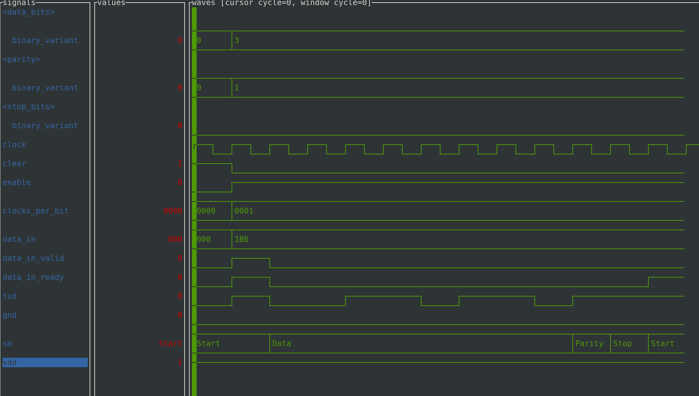

# 1.3 Quick Overview

<!--
```ocaml
# Hardcaml.Caller_id.set_mode Disabled
- : unit = ()
```
-->


Hardcaml is a library for designing and simulating Register Transfer Level (RTL) hardware
designs. Hardcaml designs can be converted to Verilog or VHDL for use with vendor
synthesis and place and route tools.

# Library Overview

## `Comb.S`, `Bits`, and `Signal`

The module type
[`Comb.S`](https://ocaml.org/p/hardcaml/latest/doc/Hardcaml/Comb/module-type-S/index.html)
defines the [combinational logic](combinational_logic.md) primitives
(i.e., logical operations, arithmetic, multiplexers, etc.) for Hardcaml.
It is implemented by both the `Bits` and `Signal` modules. All
operations work over vectors with a given bit width. Each operation
has rules about allowable argument widths and will raise an exception at
run-time if violated.

[`Bits`](https://ocaml.org/p/hardcaml/latest/doc/Hardcaml/Bits/index.html)
implements a shallow embedding of the `Comb.S` API. This means
it is used to compute values directly.

<!--
It seems we do not set the [am_testing] variable when running this code.

```ocaml
Hardcaml.Caller_id.set_mode Disabled
```
-->

```ocaml
# open Hardcaml.Bits
# let adder a b = a +: b;;
val adder : t -> t -> t = <fun>
# adder (of_string "01") (of_string "10")
- : t = 11
```

[`Signal`](https://ocaml.org/p/hardcaml/latest/doc/Hardcaml/Signal/index.html)
implements a deep embedding. This means it records the structure of a
computation as a graph.

```ocaml
# open Hardcaml.Signal
# open Hardcaml.Signal.Unoptimized
# let adder a b = a +: b;;
val adder : Type.t -> Type.t -> Type.t = <fun>
# adder (of_string "01") (of_string "10")
- : Type.t = (add (width 2) (arguments (0b01 0b10)))
```

Signals also provide functions related to [sequential logic](sequential_logic.md) (registers,
memories, and state machines).

In summary

- `Signal.t`s are used to construct hardware designs.
- `Bits.t`s can be used to *model* combinational hardware circuits conveniently.
- As we shall see, `Bits.t`s are also used for input and output ports of
  hardware simulations.

## `Circuit`

A [circuit](circuits.md) takes the output signals of a Hardcaml design and performs
various sanity checks to ensure that it can be converted to hardware. In particular, we
must provide input and output port names for our designs.

```ocaml
# let c = output "c" (adder (input "a" 8) (input "b" 8))
val c : Type.t = (wire (names (c)) (width 8) (data_in add))
# let circuit = Hardcaml.Circuit.create_exn ~name:"my_adder" [ c ]
val circuit : Hardcaml.Circuit.t = <abstr>
```

## Hardware generation with `Rtl`

A circuit can be [converted to RTL](rtl_generation.md) with Verilog or VHDL.

```ocaml
# Hardcaml.Rtl.print Verilog circuit
module my_adder (
    b,
    a,
    c
);

    input [7:0] b;
    input [7:0] a;
    output [7:0] c;

    wire [7:0] _4;
    assign _4 = a + b;
    assign c = _4;

endmodule
- : unit = ()
```

## Simulation with `Cyclesim`

Circuits can be [simulated with the `Cyclesim` module](simulation.md).

```ocaml
let sim = Hardcaml.Cyclesim.create circuit;;
let a = Hardcaml.Cyclesim.in_port sim "a";;
let b = Hardcaml.Cyclesim.in_port sim "b";;
let c = Hardcaml.Cyclesim.out_port sim "c";;
a := Hardcaml.Bits.of_unsigned_int ~width:8 10;;
b := Hardcaml.Bits.of_unsigned_int ~width:8 20;;
Hardcaml.Cyclesim.cycle sim;;
```

```ocaml
# Stdio.printf "c = %i\n" (Hardcaml.Bits.to_unsigned_int !c);;
c = 30
- : unit = ()
```

## Interfaces with `ppx_hardcaml`

An interface is a grouping of signals with associated names and bit widths.

```ocaml skip
# type 'a t =
  { a : 'a[@bits 8]
  ; b : 'a[@bits 7]
  }
  [@@deriving hardcaml];;
```

A large set of functions are generated, which make working with interfaces useful for
constructing module ports or interacting with a hardware design in simulation.

> 📝 The term interface is unfortunately a bit overloaded and commonly used to described
> mli files in OCaml, a concept in Object Oriented programming and a type representing a
> group of signals in SystemVerilog. Hardcamls use of interface is most similar to that
> of SystemVerilog.

## Waveforms



`Hardcaml_waveterm` will output [waveforms](waveforms.md) of a simulation run as ASCII
text. This allows us to integrate them with standard software development style testing
workflows. In addition an interactive viewer application is provided for detailed
analysis.

# Getting Working Hardware

Designing hardware in Hardcaml is only part of the complete process of
getting a fully working design. Let's consider the typical workflow for creating a simple
Xilinx FPGA design:

1. Design and simulate the circuit with Hardcaml.
2. Output a Verilog (or VHDL) file using Hardcaml's RTL generation functions.
3. Create a project in Vivado, the Xilinx FPGA synthesis, place and route tool.
4. Add board-level constraints (pins, timing, etc.).
5. Synthesize, place and route the design in Vivado.
6. Run static timing analysis.  If this fails, you must correct the Hardcaml design
   or adjust constraints.
7. Generate a bitstream to program the FPGA.

For steps 1 and 2, we often use a project structure with a `bin`, `src`
and `test` directory.

* `src` a library containing the hardware design.
* `test` a test library with testbenches, expect tests etc.
* `bin` an application to generate RTL code for the Vivado toolchain.
