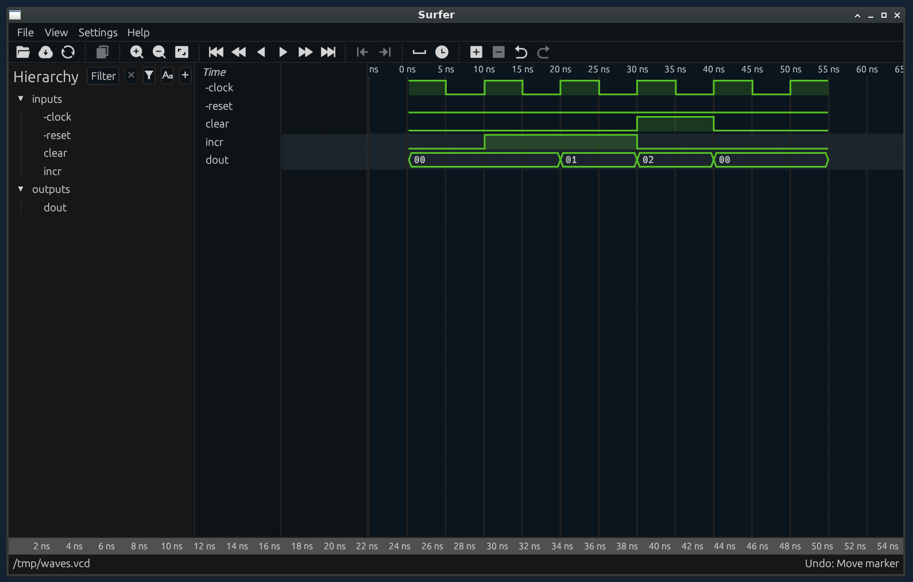

# 3.2 Waveforms

<!--
```ocaml
# Hardcaml.Caller_id.set_mode Disabled
- : unit = ()
# open Hardcaml_waveterm
# open Hardcaml_docs.Waveform
```
-->

# Hardcaml Waveterm

The [`hardcaml_waveterm`](https://github.com/janestreet/hardcaml_waveterm) library can
capture and print waveforms from Hardcaml simulations.

## Printing results as waveforms

We can make a waveform with
[`Waveform.create`](https://ocaml.org/p/hardcaml_waveterm/latest/doc/Hardcaml_waveterm/index.html).
It takes as an argument a simulator and returns a waveform and modified simulator that
captures the input and output port values.

The waveform can be displayed with `Waveform.print`.

```ocaml
# let test () =
    let sim = Simulator.create create in
    let waves, sim = Waveform.create sim in
    testbench sim;
    waves
val test : unit -> Waveform.t = <fun>

# let waves = test ()
val waves : Waveform.t = <abstr>
# Waveform.print waves
┌Signals────────┐┌Waves──────────────────────────────────────────────┐
│clock          ││┌───┐   ┌───┐   ┌───┐   ┌───┐   ┌───┐   ┌───┐   ┌──│
│               ││    └───┘   └───┘   └───┘   └───┘   └───┘   └───┘  │
│clear          ││                        ┌───────┐                  │
│               ││────────────────────────┘       └───────────────   │
│incr           ││        ┌───────────────┐                          │
│               ││────────┘               └───────────────────────   │
│               ││────────────────┬───────┬───────┬───────────────   │
│dout           ││ 00             │01     │02     │00                │
│               ││────────────────┴───────┴───────┴───────────────   │
└───────────────┘└───────────────────────────────────────────────────┘
- : unit = ()
```

## Capturing in expect tests

Waveforms can be captured as expect test output.

```ocaml skip
let%expect_test "counter" =
  let waves = test ()
  Waveform.print waves
  [%expect {|
┌Signals────────┐┌Waves──────────────────────────────────────────────┐
│clock          ││┌───┐   ┌───┐   ┌───┐   ┌───┐   ┌───┐   ┌───┐   ┌──│
│               ││    └───┘   └───┘   └───┘   └───┘   └───┘   └───┘  │
│clear          ││                        ┌───────┐                  │
│               ││────────────────────────┘       └───────────────   │
│incr           ││        ┌───────────────┐                          │
│               ││────────┘               └───────────────────────   │
│               ││────────────────┬───────┬───────┬───────────────   │
│dout           ││ 00             │01     │02     │00                │
│               ││────────────────┴───────┴───────┴───────────────   │
│               ││                                                   │
└───────────────┘└───────────────────────────────────────────────────┘
  |}]
```

`expect tests` are a form of automated testing where the expected output of a function or
component is directly embedded in the test file and automatically compared against actual
results. With waveforms we get presented with a diff as we develop or change code.
Alongside good editor integration using expect tests can be a surprisingly convenient way
to iterate on a hardware implementation.

## Configuration options

The `Waveform.print` function takes optional arguments which control the rendering of the waveform.

- `start_cycle` first cycle to display.
- `display_width`, `display_height` width and height of the waveform. The height is
  inferred if not specified.
- `wave_width` scale at which the waveform is shown (negative values allowed).
- `display_rules` configuration of the signals to show.
- `signals_alignment` left or right align the name in the signal pane.
- `signals_width` width of signal pane.
- `display_rules` configure what signals to show, and in what format.

## Display rules

```ocaml
# Waveform.print
    ~display_height:10
    ~display_rules:
      Display_rule.[ port_name_is "dout" ~wave_format:Unsigned_int
                   ; port_name_matches Re.Posix.(compile (re "cl.*")) ~wave_format:Bit ]
    waves
┌Signals────────┐┌Waves──────────────────────────────────────────────┐
│               ││────────────────┬───────┬───────┬───────────────   │
│dout           ││ 0              │1      │2      │0                 │
│               ││────────────────┴───────┴───────┴───────────────   │
│clear          ││                        ┌───────┐                  │
│               ││────────────────────────┘       └───────────────   │
│clock          ││┌───┐   ┌───┐   ┌───┐   ┌───┐   ┌───┐   ┌───┐   ┌──│
│               ││    └───┘   └───┘   └───┘   └───┘   └───┘   └───┘  │
│               ││                                                   │
└───────────────┘└───────────────────────────────────────────────────┘
- : unit = ()
```

The signals are shown in the order of the first matching `Display_rule.t`.

A display rule matches one or more signal names.

- `port_name_is` matches the given name.
- `port_name_is_one_of` matches any name in the given list.
- `port_name_matches` matches the signal name against a regular expression (defined using the OCaml RE library).

The way the value is shown is configured by a `wave_format`. Standard formatting includes
`Binary`, `Hex`, `Unsigned_int`, and `Int`. `Bit` is like binary but renders a single bit
value like the clear signal in the previous example.

`Bit_or X` will render as a bit if the width is 1 or X (which may be Hex, or Int for
example) otherwise.

`Index` takes a list of strings and looks it up based on the runtime value of the signal.

`Custom` passes the runtime value to a function which returns the string to display.

`Map` is like index but looks up the the runtime value in a map.

## Saving a waveform

Hardcaml waveforms can be saved to file using `Serialize.marshall`. It takes a waveform
and file name and saves it. Note that it also compresses the waveform data using `gzip`
which must be available.

`Serialize.unmarshall` will load the waveform.

The hardcaml waveterm library includes an executable which runs an [interactive waveform
viewer on saved waveform files](waveterm_interactive_viewer.md).

# Generating VCDs

VCDs are a common hardware design file format for storing waveforms. They can be used with
standard waveform viewers like Gtkwave.

To generate a VCD call the `Vcd.wrap` function. It takes an `Out_channel` to write to and
a simulator and returns a modified simulator to use during simulation.

The VCD will be generated as the simulation runs. The `Out_channel` being written to may
need to be flushed.

<!-- $MDX file=./lib/waveform.ml,part=vcd -->
```ocaml
let test () =
  let sim = Simulator.create create in
  let filename = "/tmp/waves.vcd" in
  let oc = Out_channel.open_text filename in
  let sim = Vcd.wrap oc sim in
  testbench sim;
  (* Closing the out channel will ensure the file is flushed to disk *)
  Out_channel.close oc;
  Stdio.print_endline ("Saved waves to " ^ filename)
;;

let%expect_test "vcd generation" =
  test ();
  [%expect {| Saved waves to /tmp/waves.vcd |}]
;;
```

This VCD file can subsequently be opened with a GUI based waveform viewer tool such as
[Surfer](https://surfer-project.org/) or [GTKWave](https://github.com/gtkwave/gtkwave).


